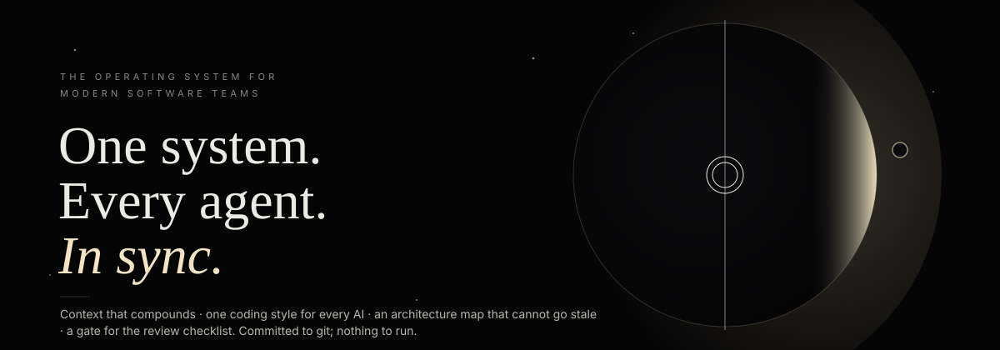
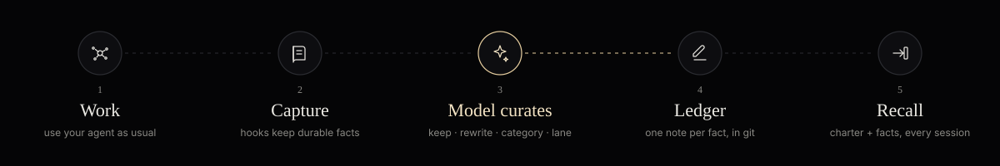

<p align="center"></p>

<p align="center"><strong>The minimal operating layer for a team building software with AI.</strong><br>One committed folder · zero dependencies · git is the database</p>

<p align="center">
<a href="#the-problems">Problems</a> · <a href="#for-your-role">Roles</a> · <a href="#how-it-works">How it works</a> · <a href="#every-feature-explained">Features</a> · <a href="#every-agent--one-point-of-contact">Agents</a> · <a href="#getting-started">Get started</a> · <a href="#honest-assessment">Honest assessment</a>
</p>

<p class="md-hero"></p>

cosmos brings your people, agents and context together: context that compounds, one coding style for every AI, an architecture map that cannot go stale, and a gate for the review checklist. Committed to git; nothing to run.

```bash
# first person on the repo · once · the only command
pip install cosmos-dev && cosmos init

# everyone after that
git clone <repo> && claude
```

<table align="center">
<tr>
<td align="center" width="33%"><br><strong>Ledger</strong><br><sub>Context that compounds</sub></td>
<td align="center" width="33%"><br><strong>Charter</strong><br><sub>One style for every AI</sub></td>
<td align="center" width="33%"><br><strong>Atlas</strong><br><sub>Your living product map</sub></td>
</tr>
<tr>
<td align="center" width="33%"><br><strong>Lanes</strong><br><sub>Focus and avoid overlap</sub></td>
<td align="center" width="33%"><br><strong>Horizon</strong><br><sub>See a feature before it lands</sub></td>
<td align="center" width="33%"><br><strong>Gate</strong><br><sub>The checklist, kept by the machine</sub></td>
</tr>
<tr>
<td align="center" width="33%"><br><strong>Flares</strong><br><sub>QA that follows the code</sub></td>
<td align="center" width="33%"><br><strong>Dreams</strong><br><sub>From activity to direction</sub></td>
<td align="center" width="33%"><br><strong>Verdicts</strong><br><sub>The human gate</sub></td>
</tr>
</table>

---

## The problems

**Eight things every team building with AI says out loud, three months into a real project.** Each one is a symptom of the same cause: knowledge, rules and structure live in individual sessions instead of in the repository.

<table>
<tr><td width="44"></td><td><em>“Everyone rescans the codebase.”</em><br><strong>Ledger</strong> · What one person's AI learns is captured, checked and handed to the next person's session before they ask.</td></tr>
<tr><td></td><td><em>“Everyone tells the AI a different coding style.”</em><br><strong>Charter</strong> · One working agreement, committed and changed in pull requests, injected into every AI session on every machine.</td></tr>
<tr><td></td><td><em>“People work across overlapping features.”</em><br><strong>Lanes</strong> · Facts, findings and diagrams are filed by feature lane; two people active in one lane this month is shown before it becomes a merge conflict.</td></tr>
<tr><td></td><td><em>“Everyone has different strengths and thinking.”</em><br><strong>Charter + Ledger</strong> · Strengths become team property: the person who knows Redis writes the constraint once; every AI inherits it. Thinking stays personal, decisions get a recorded reason.</td></tr>
<tr><td></td><td><em>“Product keeps dumping features; the app gets confusing.”</em><br><strong>Horizon</strong> · A feature enters with its lanes, the decisions it collides with, the open findings in the way and the people already there, before code is written.</td></tr>
<tr><td></td><td><em>“No architecture diagram. If there is one, it is out of date.”</em><br><strong>Atlas</strong> · Diagrams generated from the repository itself (manifests, compose, Kubernetes, Terraform, OpenAPI) and drift-checked every time those files change.</td></tr>
<tr><td></td><td><em>“Memory is one flat list, not organised by feature.”</em><br><strong>Lanes</strong> · The ledger, the index and <code>CLAUDE.md</code> are grouped by lane, the way the team actually talks about the product.</td></tr>
<tr><td></td><td><em>“Every call: did you self-review, point precisely, run the tests?”</em><br><strong>Gate</strong> · A hook holds the AI's turn until the tests for touched files ran, each change cites <code>file:line</code>, open findings on those files are addressed, a large change got a dead-code scan (vulture, knip), and the diff is reviewed against the Charter.</td></tr>
</table>

## For your role

**The same folder, read from five seats.**

| | the complaint | what changes |
|---|---|---|
| **Product manager** | “I keep adding features and the app gets more confusing. Nobody tells me what a feature collides with until it is half built.” | **Horizon** answers before a line is written: lanes touched, decisions it collides with, open findings in the way, who owns the area. The **Atlas** shows the real shape of the product, always current. |
| **Project manager** | “Three people ended up in the same feature. Every call repeats the same three asks. I cannot see who knows what.” | **Lanes** show who is active where and flag overlap this month. The **Gate** asks the three questions so the call does not have to. Dreams and Verdicts give a weekly rhythm: consolidate, decide, commit. |
| **Developer** | “I re-learn the codebase every session. My AI writes in a different style from my teammate's. I did not know that constraint existed.” | The **Ledger** hands over what others learned, matched to the files you touch. The **Charter** makes every AI write the same way. `remember:` keeps what you found in ten seconds. |
| **QA** | “My findings live in a document nobody reopens. Fixed bugs come back. Nobody tells me when a finding is picked up.” | **Flares** have a lifecycle and a board. A fixed bug reported again is flagged *regressed*. An open finding on a file the AI edits is raised at the **Gate**. Cards go to Slack once, with reactions to claim or close. |
| **Tech lead** | “There is no diagram, or it is a month old. Decisions live in people's heads.” | The **Atlas** is generated from the repo and drift-checked. Every decision in the **Ledger** carries its reason, evidence and date; contradictions surface instead of silently coexisting. |

## How it works

**Five steps. The developer does only the first.** The gold step is where the model curates; a person decides only what evidence cannot settle.

<p class="md-wide"></p>

| | step | what happens |
|---|---|---|
| 1 | **Work** | Use your agent as usual. The Charter, top facts and Atlas status are already in context. |
| 2 | **Capture** | Hooks mark the session range for the model, keep explicit `remember:` lines at once, and write one journal line per turn: what was asked, which files changed, which commits landed. Transcripts are read in place, never copied. |
| 3 | **Dream** | Runs by itself when enough is waiting. The model reads the marked session ranges in context and this developer's own Claude Code auto memory notes, and writes down what the team should still know in six months (keep · rewrite · category · lane). Duplicates merge, contradictions are flagged, facts are filed by lane, the Atlas is drift-checked. A human settles what evidence cannot. |
| 4 | **Ledger** | One markdown note per fact, with evidence. Committed. Opens as an Obsidian vault. |
| 5 | **Gate & recall** | Before the agent edits a file it is told what the team knows about that file: open flares, constraints, rules. A turn that edits code is held once: tests, `file:line`, flares addressed, and *record what the team learned* via `cosmos_remember`. A commit message naming a flare closes it. Nothing is asked of the person. |

> **Git is the database, on its own branch.** `.cosmos/` is a worktree of a `cosmos` branch inside your repository, ignored by every other branch: your feature branches never carry a ledger change, and nobody polices `.cosmos` out of a commit. The branch is committed and pushed by dreams and the watcher, merges like code, and a fresh clone attaches it on the first session start. No server, no account, no cloud.

## Every feature, explained

**What it is, what you do, what you get, and the command.** Nothing here needs a server or an account.

###  Ledger · what the team knows

| | |
|---|---|
| **what** | One markdown note per fact the team has learned (architecture, decisions and their reasons, conventions, constraints, bug root causes, dependency limits, workflows, domain rules), each with the files that prove it, the dates it was seen, how many times, and by whom. |
| **you do** | Nothing. Work in your AI tool; facts are captured when a turn ends. Type `remember: …` when something must be kept for sure. |
| **you get** | Your next session, and every teammate's, starts knowing what the last one learned, one line per fact with its id; the full note with evidence and history is one call away (`cosmos_why`). Every fact carries when it became true and when it stopped. |
| **command** | `cosmos capture` · `cosmos why` · `cosmos search` · `cosmos remember` |

###  Charter · one style for every AI

| | |
|---|---|
| **what** | A short file, `.cosmos/charter.md`: how we write code, how we test, how we point at things, how we review our own work, our architecture rules. Owned by the team, changed in pull requests. |
| **you do** | Agree it once. Add a rule when a decision is made, from the UI, the CLI, or by typing `remember:` in a session. Text pasted above the settings header is moved into the body when the editor closes. |
| **you get** | Every AI session on every machine reads it first. Personal preferences stop leaking into the codebase. Explicit rules outrank anything the AI inferred. |
| **command** | `cosmos charter` · `cosmos charter add "…"` · `cosmos charter edit` |

###  Atlas · architecture that stays true

| | |
|---|---|
| **what** | Inventory, container, deployment and API diagrams generated from what the repository already declares: package manifests, docker-compose, Kubernetes, Terraform, OpenAPI, `.env.example`, README. Every source file is fingerprinted. |
| **you do** | Nothing. `cosmos init` builds the inventory; the next dream lets the model follow the Atlas prompt and write system context, containers, data flow, deployment, a dependency index and proposed lanes. It runs again when the code the Atlas read moves. `/atlas` in Claude Code does the same interactively. |
| **you get** | A diagram that cannot quietly go stale: when compose or manifests change and the picture does not, everyone is told at the start of their session and on the Atlas page. |
| **command** | `cosmos atlas` · `cosmos atlas --deep` · `cosmos atlas --check` · `/atlas` |

###  Lanes · memory by feature

| | |
|---|---|
| **what** | Every fact, finding and diagram is filed under the feature or module it belongs to: proposed by the model, refined from the files it points at, or configured by you. |
| **you do** | Optionally name your lanes in `config.json`, or let `cosmos lanes --propose --write` do it. Otherwise nothing. |
| **you get** | A ledger organised the way the team talks about the product; per lane, who has been active in the last 30 days and where two people overlap, before it becomes a merge conflict. Each lane is an OKF concept page under `ledger/lanes/` that links its facts, flares, horizon notes and services, so the graph of the product is a folder anyone can open. |
| **command** | `cosmos lanes` · `cosmos lanes --propose --write` |

###  Horizon · features arrive with a map

| | |
|---|---|
| **what** | A one-sentence feature request turned into an impact note: lanes touched, recorded decisions it collides with, open findings in the way, people who have been working there, a suggested owner. Takes files, folders and attachments for context. |
| **you do** | `cosmos horizon "bulk invite with partial success" -f src/invites`, or type it on the Horizon page and drop files in. |
| **you get** | The conversation about a feature happens before the code, with facts. The note is saved next to the code the feature will change and travels with the pull request. |
| **command** | `cosmos horizon "…" [-f file-or-folder] [--attach file] [--brief file]` |

###  Gate · the review checklist, applied by the machine

| | |
|---|---|
| **what** | A check that runs when the AI says it is done. If the turn changed code but ran no tests, gave no `file:line` references, or ignored an open finding on a file it touched, the AI is handed the exact list and keeps going. |
| **you do** | Nothing. Tune the rules in the Charter if you want. |
| **you get** | “Did you test? Point precisely. Review your own change.” stops being something a person says on every call, and the agent writes down what it learned while it still has the full context. Proportional: a change under 400 characters in one file is held only for its `file:line` and open flares. A turn is held at most once; documentation edits are never held. Bugs found are filed as flares without asking. |
| **command** | `cosmos gate` · `cosmos gate --transcript FILE` |

###  Flares · QA that follows the code

| | |
|---|---|
| **what** | Audit findings as memory with a lifecycle: open → claimed → PR open → fixed, or needs a human, won't fix, withdrawn. A fixed bug reported again is flagged *regressed*. |
| **you do** | Import the audit JSON or type `flare: …` in a session. Move cards on the board or with one command. |
| **you get** | Flares show up when someone touches the affected file. Slack cards post once, with reactions to claim or close. A report can be regenerated any time. |
| **command** | `cosmos flares import\|list\|fix\|withdraw\|slack\|report` |

###  Dream & Verdicts · keeping it true

| | |
|---|---|
| **what** | The model reads every new observation and decides what is worth keeping, rewrites it crisply, names its category and its feature lane. Then duplicates merge, contradictions are flagged, old facts are marked for review, the Atlas is drift-checked. Anything evidence cannot settle waits for a person on the Verdicts page. |
| **you do** | Run a dream now and then (or nightly in CI), glance at Verdicts, commit. |
| **you get** | A ledger that stays small and right. Every human decision (keep, both valid, still true, forget) is recorded with who and when. |
| **command** | `cosmos dream` · `cosmos review` · the Verdicts page |

**Also in the box**

| | |
|---|---|
| **Handoff** | The last thing said on a branch is kept as its handoff, automatically; `cosmos_handoff(learned, open, next)` when stopping mid-work. The next session on that branch, on any machine, opens with it. |
| **Team sources** | Git history and pull-request review comments feed the ledger without anyone installing anything: every commit by anyone becomes a journal line; commit bodies and review remarks are offered to the model as candidate rules and facts. Reviews need the GitHub CLI logged in; on by default when it is. |
| **Open Knowledge Format** | The ledger is a conformant OKF v0.2 bundle, Google's open spec for knowledge as markdown with YAML frontmatter, so nothing about the format is invented here. Every note carries `type`, `title`, `description`, `generated`, `verified`, `status`, `stale_after` and `links`; `index.md` and `log.md` sit at the root. Relationships are OKF links: each **lane** is a concept page linking its facts, open flares, horizon notes, the **services** whose code it touches (one concept per app, service and store the Atlas found, with `resource` pointing at the code) and the people active there; each fact links back to its lane and to what it supersedes, contradicts or relates to. Any OKF consumer or graph viewer can read and traverse it; the console, Obsidian and `okf_search`-style tools all see the same graph. Retrieval is BM25 with an evidence-path boost, no vectors. |
| **Recall, measured** | Every dream records recall@5: would the right fact reach an agent working on that file or asking that question? Questions are written by the model for each fact. `cosmos eval` prints the misses. |
| **Watch** | `cosmos watch` is one local process that tails every agent's own session files for this repository, all worktrees and subagents included, captures what is new, shows who is working on what right now in the console, and starts dreams when enough is waiting. It needs no hooks, so it also covers sessions opened before cosmos existed and agents without a hook system. |
| **Recall at the edit** | The moment the agent opens a file to change it, it sees the open flares, constraints and rules attached to that file, once per file per session. Knowledge arrives at the decision, not in a report afterwards. |
| **Journal** | What the team did, not only what it learned: one line per agent turn with the ask, the files, the commits and the branch, filed by lane and person under `ledger/journal/`. A session that ships five commits and teaches no new fact is still on record. |
| **Control room** | `cosmos ui`: overview, ledger, lanes, atlas, charter, horizon, flares, dreams, verdicts, activity, docs. Localhost only; picks a free port. |
| **The model** | Uses your existing Claude Code login by default (`claude -p`), or `ANTHROPIC_API_KEY`, or any OpenAI-compatible endpoint. `COSMOS_LLM_PROVIDER=none` runs heuristics only, and says so. |
| **Privacy first** | API keys, tokens, passwords, private keys and credentials in URLs are redacted before anything is written. Sensitive folders can be excluded. Transcripts are read, never stored. |
| **Never in the way** | Hooks finish in milliseconds and exit clean. The Gate is the one deliberate hold, and it explains itself. |

## Every agent · one point of contact

**Claude Code, Codex, Gemini, Cursor, Copilot, Cline, Cowork: one store.** Teams do not use one AI tool. cosmos meets each of them three ways, and everything lives in the repository, so sharing it is a `git push`.

<table>
<tr>
<td width="33%" valign="top"><br><strong>They read the same rules</strong><br>The Charter and the key facts are written to every tool's own instruction file, kept in sync automatically.<br><br><code>CLAUDE.md</code> — Claude Code, Cowork<br><code>AGENTS.md</code> — Codex, Cursor, Copilot CLI, Gemini<br><code>GEMINI.md</code>, <code>.cursor/rules/</code>, <code>.github/copilot-instructions.md</code>, <code>.clinerules</code>, <code>.windsurfrules</code></td>
<td width="33%" valign="top"><br><strong>They call the same tools</strong><br><code>cosmos mcp</code> is a Model Context Protocol server every one of these agents can connect to. <code>cosmos init</code> writes the configs.<br><br><code>cosmos_recall</code> — facts and findings for the files you are about to touch<br><code>cosmos_remember</code>, <code>cosmos_flare</code> — write back from any tool<br><code>cosmos_charter</code>, <code>cosmos_atlas</code>, <code>cosmos_lanes</code>, <code>cosmos_horizon</code>, <code>cosmos_why</code></td>
<td width="33%" valign="top"><br><strong>They feed the same memory</strong><br>Claude Code captures through hooks, in every worktree. <code>cosmos watch</code> follows Claude Code, Codex and Gemini session files on the machine whether hooks fired or not, and keeps a live picture of who is doing what. Web and cloud sessions are covered by the committed hooks and MCP tools. Anything else writes through MCP.<br><br>hooks in the repo and for your user, written by <code>cosmos init</code><br>the watcher starts with the first session and stops after two idle hours<br><code>git push</code>: every teammate on every tool has it<br><br><sub>Nothing to run after <code>cosmos init</code>. <code>cosmos connect all</code>, <code>cosmos watch</code> and <code>cosmos hooks --user</code> repair a setup or add a tool you install later.</sub></td>
</tr>
</table>

<p align="center"><sub>Claude Code · Cowork · Codex CLI · Codex Desktop · Gemini CLI · Antigravity · Cursor · GitHub Copilot · Cline · Windsurf · Obsidian</sub></p>

### Cowork, and sessions that were already open

**Cowork** runs Claude Code in a sandbox with its own settings, so a project's hooks and a local MCP server in Claude Desktop's config never reach it. The cosmos plugin does. This repository is also a plugin marketplace: in Cowork, add it as a marketplace (its GitHub `owner/cosmos` path) and install **cosmos**. The plugin finds every shared folder that has `.cosmos/`, one level down included (a workspace folder of several projects), and serves that repository's own copy of cosmos over MCP, so no install is needed inside the sandbox. Cowork starts a fresh process for each message, so the tools appear with your next message, in the session you already have open. The same plugin works in Claude Code: `/plugin marketplace add owner/cosmos`, then `/plugin install cosmos@cosmos`. Capture from Cowork needs no plugin: the watcher reads Cowork transcripts on the machine and maps the sandbox paths back.

**Sessions older than cosmos.** The user-level hooks run in every repository and check for `.cosmos/` on each event, so a Claude Code session that was open before `cosmos init` starts capturing on its next turn, and its next prompt carries the briefing it missed at start (Charter, key facts, handoff, Atlas). Nothing to restart.

## Getting started

**One person runs one command once. Everyone else clones.** Nothing else is a step: capture, reading, dreams, the watcher and the hook refresh happen by themselves.

**1 · `cosmos init`, once.** Creates `.cosmos/` with the Charter, the Ledger, the first Atlas and the `/atlas` prompt; wires hooks at repo and user level, so every worktree is covered; writes MCP configs and the instruction files of every agent; reads the sessions this repo already had, writes their journal, marks the recent ones for the model, and starts the first dream and the watcher in the background.

```bash
pip install cosmos-dev
cd <your-repo>
cosmos init
cosmos flares import <findings.json> --prefix <ID-PREFIX>   # only if you have an audit document
```

**2 · Agree the Charter, then commit.** Edit `.cosmos/charter.md` in a pull request; that is the team agreeing on one style. Commit and the memory becomes the team's.

```bash
cosmos charter edit
git add .claude/settings.json .claude/commands .mcp.json CLAUDE.md AGENTS.md GEMINI.md .gitignore   # once; the ledger itself is on the cosmos branch
git commit -m "cosmos: hooks and instruction files" && git push
```

**3 · Everyone else clones and opens their agent.** No install, no setup. Claude Code, Codex, Cursor, Gemini CLI, Copilot, Cline or Cowork all read the same Charter, facts and tools; a committed wrapper runs cosmos from the repository. Sessions that were already open pick cosmos up on their next turn; Cowork gets the tools from the cosmos plugin.

```bash
git clone <repo> && cd <repo>
# open your agent: claude · codex · cursor . · gemini · …
```

**4 · Look, now and then.** `cosmos ui` shows the live sessions, the ledger, the lanes, the flares and what waits for a human on Verdicts. Dreams run by themselves; commit `.cosmos` with your normal work and everyone gets it on the next `git pull`. Map a feature before coding with `cosmos horizon "<feature in one sentence>"` or on the Horizon page.

> **Want a fact or rule kept for certain?** Type `remember: never modify production schemas by hand` or `flare: /transitions has no role gate` in any agent, or call `cosmos_remember` over MCP. Explicit rules always outrank inferred ones.

## Already have a codebase?

**Link an existing project and its past sessions.** Most projects already have months of history: AI sessions on several machines, an audit document, branches nobody has drawn. `cosmos init` brings the sessions in by itself; the rest is agreeing the Charter and committing. Full guide: [docs/link-existing-codebase.md](docs/link-existing-codebase.md).

| | step | command |
|---|---|---|
| 1 | Initialise. This also reads every past session (all worktrees, subagents), writes their journal, marks recent history for the model, starts the first dream and the watcher | `cd <your-repo> && cosmos init` |
| 2 | Bring in an existing audit, if there is one. If the file does not exist yet, cosmos asks before creating an empty one to fill in (`--yes` creates it without asking). | `cosmos flares import <findings.json> --prefix <ID-PREFIX> --source <report-name>` |
| 3 | Look while the first dream finishes in the background | `cosmos ui` |
| 4 | Agree the Charter, commit the wiring on a branch off your base branch | `cosmos charter edit` · `git checkout -b cosmos/init origin/<base-branch>` · add `.claude/settings.json .claude/commands .mcp.json CLAUDE.md AGENTS.md GEMINI.md .gitignore` · commit · `git push -u origin cosmos/init`. The ledger itself is on the `cosmos` branch, pushed by itself. |
| 5 | Sessions that were already open | nothing to restart: the next prompt carries the briefing; in Cowork, install the cosmos plugin once ([plugin](docs/plugin.md)) |
| 6 | Teammates | `git pull`, then open their agent |

Transcripts live in `~/.claude/projects/<repo path, slashes → dashes>/` (Claude Code), `~/.codex/sessions/` (Codex), `~/.gemini/` (Gemini). They are read, never stored; secrets are redacted. `.claude/settings.local.json` is personal and untouched; `.cosmos/state/` is gitignored.

## What we learned from others

**We took the ideas that need no infrastructure.** Several tools solve pieces of this well. We kept every strength that works with nothing more than git and a command line, and left out what needs an engine.

| tool | its strength | in cosmos |
|---|---|---|
| Letta Context Repositories | Memory is versioned in git; conflicts are settled in pull requests. | The Ledger and Charter are markdown in the repo. Every change is a diff; contradictions go through review. |
| ai-memory | Local-first, driven by editor lifecycle hooks. | Hooks capture in milliseconds; the model does the thinking later, at dream time. |
| MemContext | Facts cite their source; the system learns from human corrections. | Every fact carries evidence files, dates and observers. Verify, keep and forget decisions are recorded as memory. |
| ZeroShot | One memory shared across Claude Code, Cursor and Copilot. | Charter and facts are written to every agent's instruction file and served over MCP. |
| ContextOps practice | A hierarchical `CLAUDE.md` / `AGENTS.md`: what, how, why. | Generated and kept current: the Charter is the *how*, the Ledger the *why*, the Atlas the *what*. |
| Architecture-diagram prompts | “Inventory first, then diagrams” gives good Mermaid from a repo. | Built in: `cosmos atlas` does the inventory from files git tracks; dreams run the prompt as a deep pass through the model; drift triggers the next one. |
| Augment Code | Maps dependencies across 400k-file codebases. | Deliberately not taken. That needs an indexing engine. cosmos stays a few thousand lines of standard-library Python. |

## Honest assessment

| Why it is a good fit | Where it falls short today |
|---|---|
| Nothing to run. No database, no server, no account, and no API key: the model is your existing Claude Code login. | Hooks do not extract anything themselves: they mark the session range and write the journal, and the model reads the conversation at dream time. Reading costs model calls (about one per 9k characters of session), so a busy team's dream takes minutes, in the background. With no model available for three days, the old heuristics keep what they can, and the dream says so. |
| Zero effort for developers after the first setup; the second person just clones. | The Atlas reads manifests and specs, not a code graph: no call chains, no dependency analysis inside the code. |
| One place for rules, facts and structure, inspectable as plain files, diffs and Obsidian notes. | The Gate checks that tests *ran*, not that they were the right tests or that they passed. |
| Wrong facts cannot hide: evidence and age on every one. Stale diagrams cannot hide: drift is reported. | Capture and Gate hooks exist for Claude Code only; Codex and Gemini are read from their logs; other agents write through MCP. |
| The review checklist stops being a person's job. | Memory is per repository; cross-repo recall inside the hooks does not exist yet. |
| Privacy by construction: local-first, secrets redacted, transcripts never stored. | Verdicts are trust-based; the audit trail is git history, not roles. No Jira integration. |

## Checked by something that is not Claude

cosmos is built with Claude. It should not be graded by Claude. `validation/` asks an independent decision-only model (TypeSafe's Jev) a fixed set of closed questions about what cosmos produced in your repository, compares the answers with what cosmos decided, and writes one report with aggregates only: does the evidence support each fact, should each observation have been kept, is each doubtful fact really outdated, is each retrieved fact relevant, does the code implement each documented claim. New features are reported separately from existing ones. One command, a key from typesafe.ai or Cloudflare Workers AI, about half a cent per repository. See [validation/README.md](validation/README.md).

## Why use this

**The cost you pay today is invisible.** Nobody files a ticket for “rediscovered the same constraint as last week”, “the AI used a different style again”, or “the diagram was wrong”. It shows up as slower onboarding, repeated mistakes, review calls that repeat themselves, and a quiet erosion of trust in the AI tools. cosmos makes the knowledge, rules and structure that already exist in your team stay put, for the price of one `init`.

And it is safe to try. It writes one folder and a few lines into files you already have. Remove the hooks with one command (`cosmos uninstall`) and nothing else changes.

## Why we made this

**Three months in, eight complaints, one cause.** We were building a product across several repositories with Claude Code. People overlapped on features, each told the AI a different style, product added features faster than the picture could hold, there was no architecture diagram anyone trusted, and every call repeated the same asks. A QA audit produced twenty-nine findings that lived in a document nobody reopened.

The tools we looked at either wanted a hosted service or solved one slice. We wanted the minimal whole: memory, rules, structure and a gate, versioned with the code, with nothing to operate.

> The killer feature is not that the AI remembers. It is that the team stops repeating itself.

## Layout

```
.cosmos/              a worktree of the `cosmos` branch — ignored by your branches, pushed by itself
  charter.md          the team's working agreement (injected first)
  ledger/             one markdown note per fact · finding/ (flares) · horizon/
  atlas/              inventory + Mermaid diagrams, fingerprints
  config.json         lanes, LLM provider, excludes
  cosmosw             zero-install wrapper (runs the vendored copy)
  state/              gitignored: pending observations, dream runs
```

Guides: [plugin (Cowork, Claude Code)](docs/plugin.md) · [memory model](docs/memory-model.md) · [charter and gate](docs/charter-and-gate.md) · [lanes and horizon](docs/lanes-and-horizon.md) · [atlas](docs/atlas.md) · [audit and findings](docs/flares.md) · [hooks](docs/hooks.md) · [Obsidian](docs/obsidian.md) · [link an existing codebase](docs/link-existing-codebase.md)

<p align="center"><sub>cosmos · MIT licence · Python 3.9+, standard library only · <code>cosmos doctor</code> checks a setup · <code>cosmos ui</code> opens the control room</sub></p>
